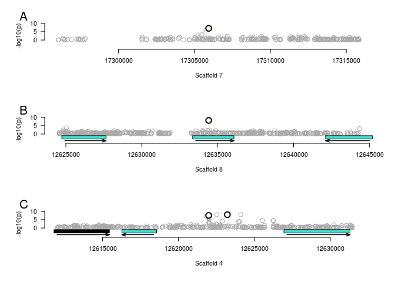

### Make Gemma Input files

Bim and bam files

```bash
##scaf1_8.tags.map and scaf1_8.tags.ped generated by YWL
gunzip ../data/gemma/scaf1_8.tags.ped.gz
plink --noweb --file ../data/gemma/scaf1_8.tags --keep ../data/gemma/146_DNA_names_forplink --recode --out ../data/gemma/tags146 
plink --noweb --file ../data/gemma/tags146 --make-bed --out ../data/gemma/tags146 

```


Make the fam file for gemma:

```r
load('data/wgcna-files/PlantSigned-networkConstructionEM-stepByStep.RData')

qn <- function(x){qqnorm(x, plot.it=FALSE)$x}
nEigens = data.frame(apply(MEs, 2,qn))
nEigens$id = mymer2$V2


tfam = read.table('data/gemma-files/t146.fam', stringsAsFactors = F)

inlist = read.table('data/id-list', stringsAsFactors = F, header=T)

#stick fam names onto the normalized iegenvectors
namemerge = dplyr::left_join(nEigens, namecol, by="DNA_short.name")
allmerge = dplyr::left_join(myfam, namemerge, by = c('V2' = "DNA_vcfname"))

newfam = allmerge[,c(1:5, 31:45)]
write.table(newfam, file = 'data/tags146.fam', row.names=F, col.names=F, quote=F)
```

Run gemma on the hpcc.

```bash

cd /mnt/home/josep993/trans-eQTL/data/gemma/batched-tags/
~/Apps/gemma-0.98.1-linux-static -bfile tags146 -k -gk 2 -o tags146
mv output/t146.sXX.txt .
~/Apps/gemma-0.98.1-linux-static -bfile tags146 -k tags146.sXX.txt -lmm 2 -n $SLURM_ARRAY_TASK_ID -maf 0.05 -o tb.$SLURM_ARRAY_TASK_ID
Rscript --vanilla parse-gemma-output.R output/tb.${SLURM_ARRAY_TASK_ID}.assoc.txt tb.${SLURM_ARRAY_TASK_ID}.tophits
```


Here is the rcode for parse-gemma-output.R

```r
args = commandArgs(trailingOnly=TRUE)


myresults = read.table(args[1], header=T, stringsAsFactors=F)

myresults$fdr = p.adjust(myresults$p_lrt, method="fdr")
sigresults = myresults[myresults$fdr < 0.25,]
write.table(sigresults, file = args[2], row.names=F, quote=F)
```


Look at the results

```r
allhitslist = sapply(1:16, function(i){
myhits = read.table(paste( 'data/gemma-files/tb.',i,'.tophits', sep=""   ), stringsAsFactors=F, header=T)  
if (nrow(myhits) > 0){ myhits$module <- i}
  return(myhits)
})

allhits = do.call("rbind", allhitslist)

sighits = dplyr::filter(allhits, fdr < 0.1)
sighits
```

```
##   chr                  rs       ps n_miss allele1 allele0    af   logl_H1 l_mle
## 1   7 scaffold_7:17305936 17305936      0       A       G 0.093 -185.0856 1e+05
## 2   8 scaffold_8:12634406 12634406      0       C       T 0.317 -182.4722 1e+05
## 3   4 scaffold_4:12621988 12621988      0       C       T 0.066 -183.9238 1e+05
## 4   4 scaffold_4:12623220 12623220      0       A       T 0.052 -182.8667 1e+05
##          p_lrt        fdr module
## 1 1.025370e-07 0.09574403      9
## 2 6.937162e-09 0.01295516      9
## 3 2.858041e-08 0.02668699     16
## 4 9.623431e-09 0.01797178     16
```


Where are the sighnificant hits? Make manhattan plots.


First need to pull out the regions around hits from the gemma output files

```bash
cd data/gemma-files
rsync -ave ssh josep993@rsync.hpcc.msu.edu:trans-eQTL/data/gemma/batched-new/output/tb.9.assoc.txt .
rsync -ave ssh josep993@rsync.hpcc.msu.edu:trans-eQTL/data/gemma/batched-new/output/tb.9.assoc.txt .
awk '$1 == 7 && $3 > 17295936 && $3 <  17315936' tb.9.assoc.txt > eqtl1.txt
awk '$1 == 8 && $3 > 12624406 && $3 <  12644406' tb.9.assoc.txt > eqtl2.txt
awk '$1 == 4 && $3 > 12611988 && $3 <  12631988' tb.16.assoc.txt > eqtl3.txt
```

Second, pull out the genes nearby and figure out what modules they're in

```r
load('data/wgcna-files/PlantSigned-networkConstructionEM-stepByStep.RData')
myexp = read.table('data/all.med.min5', header=T, stringsAsFactors = F)
moduledf = data.frame(pac = myexp$pac, module = moduleColors, stringsAsFactors = F)

gff = read.table('data/CR.mRNAonly.gff', stringsAsFactors = F)
gff$pac = sapply(gff$V9, function(x){strsplit( strsplit(x, ';')[[1]][3], '=')[[1]][2]}) ##read in the gff with gene locations

modulelocs = dplyr::inner_join(moduledf, gff, by="pac")##merge locations with modules
```

Third, make the manhattan plots

```r
moduleIndex = substr(names(MEs), 3, 100)
abc = c('A','B','C')

plotsnp <- function(y){
  x= sighits[y,]
  myfile = read.table(paste('data/gemma-files/eqtl',y,'.txt',sep=""), header=F, stringsAsFactors=F)
  names(myfile) = names(sighits)[-c(11,12)]
  plot(myfile$ps, -log10(myfile$p_lrt),xlim = c(x[[3]]-1e4,x[[3]]+1e4), ylim = c(-5, 10),col = 'darkgray', cex=1.5, xlab=paste('Scaffold ',as.character(x$chr), sep=""), bty="n", yaxt="n", xaxt="n", ylab = "-log10(p)")
  points(x$ps, -log10(x$p_lrt), col = 'black', pch=21, bg = moduleIndex[x$module], cex=2, lwd=2)
  axis(2, las=2, at = c(0,5,10))
  axis(1)
  
  nearbyGenes = dplyr::filter(modulelocs, V1 == paste('scaffold_',x$chr,sep=""), V4 > x[[3]]-3e4, V5 < x[[3]]+3e4)
  if (nrow(nearbyGenes) > 0){rect(nearbyGenes$V4,rep(-1,nrow(nearbyGenes)),nearbyGenes$V5,rep(-3,nrow(nearbyGenes)),col=nearbyGenes$module, border='black')
    test = sapply(1:nrow(nearbyGenes), function(g){
      if (nearbyGenes[g,]$V7 == "+"){arrows(nearbyGenes[g,]$V4+200, -4, nearbyGenes[g,]$V5, -4, angle=20, length = 0.07, lwd=1.5)}
    if (nearbyGenes[g,]$V7 == "-"){arrows(nearbyGenes[g,]$V5-200, -4, nearbyGenes[g,]$V4, -4, angle=20, length = 0.07, lwd=1.5)}})}
  
  #   sameScaf <- mods[mods$V1 == paste("scaffold_",as.character(x[[2]]),sep=""),]
  if (y==3){points(sighits$ps[4], -log10(sighits$p_lrt[4]), pch=21, col = 'black',bg = moduleIndex[x$module], cex=2, lwd=2)}
  mtext(abc[y], side=3, adj=-0.05, cex=1.3)
  
  }

par(mfrow=c(3,1), mar=c(4,4,2,1))
sapply(1:3, plotsnp)
```

<!-- -->

```
## [[1]]
## NULL
## 
## [[2]]
## NULL
## 
## [[3]]
## NULL
```


Are any of them also in the all-by-all analysis?

```r
load('data/matrixeqtl-files/matrixeqtl-batched.rda')
allbyall = meCovar$all$eqtls

myoverl = lapply(1:4, function(x){
  myeqtl = sighits[x,]
  myrs = myeqtl$rs
  overl = dplyr::filter(allbyall, snps == myrs)
  return(overl)
})
# 
##are any eqtls of nearby genes? Nope

##2nd eQTL
x = sighits[2,]
nearby2 = dplyr::filter(modulelocs, V1 == paste('scaffold_',x$chr,sep=""), V4 > x[[3]]-5e4, V5 < x[[3]]+5e4)
over2 = dplyr::filter(myoverl[[2]], gene %in% nearby2$pac)
nrow(over2)
```

```
## [1] 0
```

```r
##3rd eQTL
x = sighits[3,]
nearby3 = dplyr::filter(modulelocs, V1 == paste('scaffold_',x$chr,sep=""), V4 > x[[3]]-5e4, V5 < x[[3]]+5e4)
overl3 = myoverl[[3]]
overl3$pac = as.character(overl3$gene)
over3 = dplyr::filter(overl3, pac %in% nearby3$pac)
nrow(over3) ###CHECK GENE VS FACTOR ISSUES
```

```
## [1] 0
```

1st eQTL is intergenic
2nd eQTL is a 4fold site
3rd eQTL is intergenic
4th eQTL is in a CNC!
