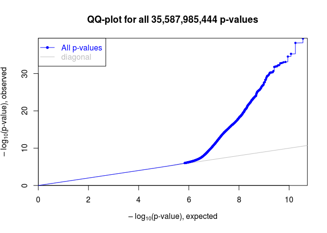
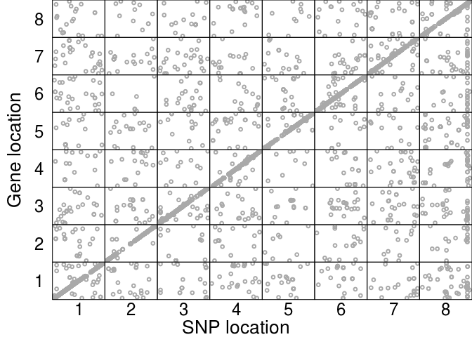
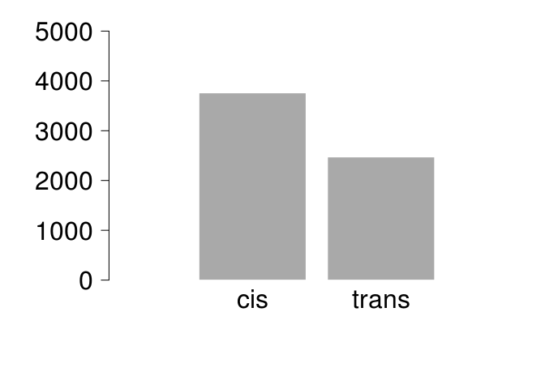

##Get the batch-corrected expression data together for mapping

```r
load('data/wgcna-files/combatOutput.rda')

mycbnames = read.table("data/wgcna-files/mycb-names", stringsAsFactors = F)

qn <- function(x){qqnorm(x, plot.it=FALSE)$x}
# nnormed = data.frame(t(apply(outtable[,-1], 1,qn)))
normcb = apply(mycb, 1, qn)#quantile normalize, now columns genes, rows are inds


mycbdf = data.frame(id = mycbnames$x, normcb, stringsAsFactors = F)

matrixeqtlids = data.frame(V1 = strsplit('10    100    101    102_long    105_clipinplace_sorted    106s_clipped    107    108_3    109    110    111    112    113    114_long    115    117s_clipped    118    11s_clipped    121    123    124_3    125_clipped.bam    126s_clipped    128    129s_clipped    13    131s_clipped    132    133    135    136    137s_clipped    138    139    140    141    142    143s_clipped    144s_clipped    147    148    14_clipped.bam    15    151    152    153    154    155_clipped.bam    156    157    158    160    161_clipped.bam    162    163_clipped    165_clipped.bam    167    16_clipped    17    170_clipped    174_clipped.bam    175_clipped    176    177    178    18    181    182_3    183    184_3    186    187    189    190    192    193    194    195    197    198    1_clipped    20    200    202_long    203_long    204_long    23s_clipped    24    25    26    27    28    29_clipped    30    31    33    34    35    36    38    39s_clipped    41    43s_clipped    44s_clipped    47    49_clipped.bam    4s_clipped    50_long    52    54_clipped    55_clipped    58    5_clipped    61    63    64_replacement    65_clipped    66_clipped    67    70s_clipped    71    72    74    75    76    78s_clipped    79    7s_clipped    8    80s_clipped    81s_clipped    82s_clipped    83    85_long    86    89    9    91    92    93    94    95    96    97_3    98_clipped    99_clipped', split = "    ")[[1]], stringsAsFactors = F)


meExp = data.frame(c('id', row.names(mycb)),t(dplyr::left_join(matrixeqtlids, mycbdf, by = c('V1'='id'))), stringsAsFactors = F)
write.table(meExp, file = 'data/matrixeqtl-files/cbExp', row.names=F, quote=F, col.names=F)
```


```r
load('data/matrixeqtl-files/matrixeqtl-batched.rda')
plot(meCovar)
```

<!-- -->

```r
geneloc = read.table('data/matrixeqtl-files/genelocation.matrixeqtl', header=T, stringsAsFactors = F)
geneloc$gene = as.character(geneloc$geneid)

## merge gene locations with eQTL results (looking at Tag sites only)
locmerge = dplyr::left_join(meCovar$all$eqtls, geneloc, by = "gene")
```

```
## Warning: Column `gene` joining factor and character vector, coercing into
## character vector
```

```r
locmerge$snpchr = sapply(locmerge$snps, function(x){strsplit(as.character(x),':')[[1]][1]})
locmerge$snppos = sapply(locmerge$snps, function(x){strsplit(as.character(x),':')[[1]][2]})


#get xlim for the plot
myxlim = lapply(1:8, function(x){
  mychr = dplyr::filter(locmerge, snpchr == paste('scaffold_',as.character(x),sep=""))
  mymax = max(as.numeric(mychr$snppos))
  mymin = min(as.numeric(mychr$snppos))
  return(c(mymin, mymax))
  })

eqtlsforplot = dplyr::filter(locmerge, FDR < 0.1)


#postscript("figures/eqtls-pcs.eps",height=9,width=9,paper="special",horizontal=FALSE,colormodel="cymk")
par(mfrow=c(8,8), mar=c(0,0,0,0))
par(mar=c(0,0,0,0))
layout(matrix(c(1,2:9,1,10:17,1,18:25,1,26:33,1,34:41,1,42:49,1,50:57,1,58:65, rep(66,9)), 9, 9, byrow = TRUE))
plot.new()
text(0.5,0.5,"Gene location", srt=90, cex=2.5)
for (i in 8:1){ ##gene locations
  for (j in 1:8){  ##snp location
  mygenechr = paste('scaffold_',as.character(i),sep="")
  mysnpchr = paste('scaffold_',as.character(j),sep="")
mychrom = dplyr::filter(eqtlsforplot, chr ==mygenechr & snpchr == mysnpchr)
mysigfdr = dplyr::filter(mychrom, FDR<0.1)
plot(mychrom$snppos,mychrom$s1, col = 'gray', xlab = "", ylab = "", yaxt="n", xaxt="n", cex=1.5, xlim = myxlim[[j]])
#text(100000,100000,paste('gene location is',as.character(i)))
points(mysigfdr$snppos, mysigfdr$s1, col = 'black', pch=16, cex=1.5)  
if (j==1){mtext(i, side = 2, cex=2, las=2, line=1)} ##if at chrom 1 for snps
if(i==1){mtext(j, side=1, cex=2, line=2)} ## if at chrom 1 for genes

  }
}
plot.new()
text(0.5,0.4, "SNP location", cex=2.5)
legend('bottomright', c('FDR < 0.75','FDR < 0.1'), col = c('gray','black'), pch=c(1,16), cex=1.5, bty="n")
```

<!-- -->

```r
#dev.off()


##remove ones with >100 eQTLs
genecounts = dplyr::count(locmerge, gene)
names(genecounts) = c('gene','numbereQTLs')

par(mfrow=c(1,1), mar=c(5,5,2,2))
hist(genecounts$numbereQTLs, col="navy", border="navy", breaks=100, main = "eQTLs per gene", xlab ="")
```

<!-- -->

```r
hist(genecounts$numbereQTLs, col="navy", border="navy", breaks=100, main = "eQTLs per gene", xlab ="", xlim = c(50,1000), ylim =c(0,80))
```

<!-- -->

```r
weirdos = dplyr::filter(genecounts, numbereQTLs>29)
dim(weirdos)
```

```
## [1] 73  2
```

```r
keepsnps = dplyr::filter(genecounts, numbereQTLs < 30)

finalset = dplyr::filter(locmerge, gene %in% keepsnps$gene, !is.na(chr))


## look at the hotspot on scaffold 8?
dplyr::filter(meCovar$all$eqtls, snps=="scaffold_8:12634406")
```

```
##                    snps     gene statistic       pvalue         FDR       beta
## 1   scaffold_8:12634406 20900171  6.819259 2.573783e-10 0.001727570  0.7482330
## 2   scaffold_8:12634406 20889260  6.783921 3.093828e-10 0.002028428  0.7355418
## 3   scaffold_8:12634406 20888926  6.782750 3.112730e-10 0.002038943  0.7477061
## 4   scaffold_8:12634406 20894570  6.490819 1.398907e-09 0.007439578  0.7195054
## 5   scaffold_8:12634406 20912992  6.488058 1.418717e-09 0.007527850  0.7203926
## 6   scaffold_8:12634406 20890608  6.483586 1.451385e-09 0.007672774  0.7223259
## 7   scaffold_8:12634406 20901376  6.472514 1.535493e-09 0.008047880  0.7209554
## 8   scaffold_8:12634406 20889561  6.441233 1.799926e-09 0.009228606  0.7166209
## 9   scaffold_8:12634406 20897603  6.411270 2.095064e-09 0.010498326  0.7105271
## 10  scaffold_8:12634406 20886874  6.401722 2.198770e-09 0.010949223  0.7143241
## 11  scaffold_8:12634406 20888686  6.372858 2.543961e-09 0.012403680  0.7105758
## 12  scaffold_8:12634406 20891442  6.350131 2.852834e-09 0.013666256  0.7072156
## 13  scaffold_8:12634406 20910088  6.308951 3.509273e-09 0.016263569  0.7036462
## 14  scaffold_8:12634406 20901794  6.286880 3.920104e-09 0.017883427  0.7024119
## 15  scaffold_8:12634406 20896504  6.276997 4.119080e-09 0.018626399  0.7020106
## 16  scaffold_8:12634406 20905173  6.267822 4.312671e-09 0.019351819  0.7012075
## 17  scaffold_8:12634406 20902727  6.260983 4.462783e-09 0.019917412  0.7010623
## 18  scaffold_8:12634406 20901328  6.260631 4.470639e-09 0.019939972  0.6988751
## 19  scaffold_8:12634406 20905947  6.238159 5.001854e-09 0.021932716  0.7021836
## 20  scaffold_8:12634406 20902834  6.221694 5.430018e-09 0.023483218  0.6955421
## 21  scaffold_8:12634406 20899948  6.209433 5.772054e-09 0.024713161  0.6969111
## 22  scaffold_8:12634406 20899248  6.199658 6.059870e-09 0.025717240  0.6957073
## 23  scaffold_8:12634406 20910263  6.193610 6.244956e-09 0.026351128  0.6926290
## 24  scaffold_8:12634406 20913261  6.192924 6.266276e-09 0.026431688  0.6976221
## 25  scaffold_8:12634406 20909172  6.190126 6.354082e-09 0.026755401  0.6942896
## 26  scaffold_8:12634406 20909181  6.183362 6.571310e-09 0.027506431  0.6946305
## 27  scaffold_8:12634406 20910178  6.183216 6.576077e-09 0.027523151  0.6929246
## 28  scaffold_8:12634406 20899633  6.179816 6.688103e-09 0.027916505  0.6927805
## 29  scaffold_8:12634406 20911702  6.164205 7.226999e-09 0.029754087  0.6924460
## 30  scaffold_8:12634406 20897011  6.162277 7.296467e-09 0.029991516  0.6916079
## 31  scaffold_8:12634406 20914131  6.150389 7.739416e-09 0.031528183  0.6910472
## 32  scaffold_8:12634406 20885839  6.110915 9.408242e-09 0.037156851  0.6874343
## 33  scaffold_8:12634406 20895146  6.101539 9.853866e-09 0.038638083  0.6865698
## 34  scaffold_8:12634406 20892563  6.101290 9.865988e-09 0.038677091  0.6861139
## 35  scaffold_8:12634406 20912958  6.100880 9.885957e-09 0.038729777  0.6864430
## 36  scaffold_8:12634406 20892924  6.092648 1.029560e-08 0.040047665  0.6860942
## 37  scaffold_8:12634406 20893993  6.089123 1.047608e-08 0.040608062  0.6872704
## 38  scaffold_8:12634406 20894682  6.088618 1.050219e-08 0.040689106  0.6850202
## 39  scaffold_8:12634406 20886529  6.070436 1.148594e-08 0.043886790  0.6839195
## 40  scaffold_8:12634406 20906963  6.066771 1.169490e-08 0.044551283  0.6829357
## 41  scaffold_8:12634406 20888596  6.063829 1.186538e-08 0.045070426  0.6821343
## 42  scaffold_8:12634406 20908449  6.056976 1.227194e-08 0.046347623  0.6831911
## 43  scaffold_8:12634406 20910319  6.055361 1.236973e-08 0.046622956  0.6831165
## 44  scaffold_8:12634406 20888102  6.053171 1.250358e-08 0.047047715  0.6818034
## 45  scaffold_8:12634406 20896364  6.049806 1.271201e-08 0.047660634  0.6809918
## 46  scaffold_8:12634406 20890834  6.049650 1.272176e-08 0.047677092  0.6811770
## 47  scaffold_8:12634406 20896023  6.025173 1.434509e-08 0.052408654  0.6785677
## 48  scaffold_8:12634406 20902153  6.016526 1.496584e-08 0.054214593  0.6772270
## 49  scaffold_8:12634406 20903680  6.008053 1.559964e-08 0.056065642  0.6791893
## 50  scaffold_8:12634406 20893014  6.008052 1.559970e-08 0.056065642  0.6766804
## 51  scaffold_8:12634406 20897799  6.006724 1.570143e-08 0.056340214  0.6779325
## 52  scaffold_8:12634406 20899732  6.003745 1.593189e-08 0.056971847  0.6798734
## 53  scaffold_8:12634406 20893276  6.002938 1.599495e-08 0.057128473  0.6774618
## 54  scaffold_8:12634406 20904280  6.000076 1.622039e-08 0.057763412  0.6756082
## 55  scaffold_8:12634406 20903096 -5.998602 1.633772e-08 0.058078781 -0.6774817
## 56  scaffold_8:12634406 20901887  5.998546 1.634217e-08 0.058088777  0.6773089
## 57  scaffold_8:12634406 20901719  5.993241 1.677154e-08 0.059354163  0.6797391
## 58  scaffold_8:12634406 20898777  5.988506 1.716404e-08 0.060430714  0.6764619
## 59  scaffold_8:12634406 20908519  5.968246 1.894794e-08 0.065671114  0.6729068
## 60  scaffold_8:12634406 20907157  5.966365 1.912247e-08 0.066154386  0.6746363
## 61  scaffold_8:12634406 20910960  5.959640 1.975966e-08 0.067910353  0.6771680
## 62  scaffold_8:12634406 20907962  5.958176 1.990108e-08 0.068316704  0.6740408
## 63  scaffold_8:12634406 20895463  5.956859 2.002920e-08 0.068696885  0.6739288
## 64  scaffold_8:12634406 20887028  5.955313 2.018056e-08 0.069094916  0.6739499
## 65  scaffold_8:12634406 20903461  5.955215 2.019016e-08 0.069115730  0.6745487
## 66  scaffold_8:12634406 20891825  5.948096 2.090224e-08 0.071129145  0.6743341
## 67  scaffold_8:12634406 20909944  5.939464 2.179869e-08 0.073595632  0.6669327
## 68  scaffold_8:12634406 20905792  5.936663 2.209761e-08 0.074414222  0.6714777
## 69  scaffold_8:12634406 20906918  5.935275 2.224721e-08 0.074800952  0.6737607
## 70  scaffold_8:12634406 20886715  5.934770 2.230194e-08 0.074944134  0.6734814
## 71  scaffold_8:12634406 20910593  5.928075 2.303947e-08 0.076854354  0.6723550
## 72  scaffold_8:12634406 20899049  5.920851 2.386205e-08 0.079113303  0.6720051
## 73  scaffold_8:12634406 20899958  5.904328 2.585346e-08 0.084441315  0.6688768
## 74  scaffold_8:12634406 20896094  5.899347 2.648513e-08 0.086096995  0.6696315
## 75  scaffold_8:12634406 20890708  5.894070 2.717097e-08 0.087817637  0.6672014
## 76  scaffold_8:12634406 20896560  5.892805 2.733786e-08 0.088220840  0.6703963
## 77  scaffold_8:12634406 20911471  5.891392 2.752553e-08 0.088649614  0.6640708
## 78  scaffold_8:12634406 20895106  5.890247 2.767858e-08 0.089029734  0.6657540
## 79  scaffold_8:12634406 20888682  5.888323 2.793748e-08 0.089692256  0.6699824
## 80  scaffold_8:12634406 20901007  5.886787 2.814596e-08 0.090198820  0.6684663
## 81  scaffold_8:12634406 20911085  5.886549 2.817837e-08 0.090286444  0.6660478
## 82  scaffold_8:12634406 20912034  5.882484 2.873807e-08 0.091642466  0.6685327
## 83  scaffold_8:12634406 20899316  5.880622 2.899814e-08 0.092281624  0.6695760
## 84  scaffold_8:12634406 20903293  5.879632 2.913728e-08 0.092642767  0.6667031
## 85  scaffold_8:12634406 20891633  5.879157 2.920439e-08 0.092838349  0.6678774
## 86  scaffold_8:12634406 20885704  5.878470 2.930158e-08 0.093097425  0.6661168
## 87  scaffold_8:12634406 20888216  5.873988 2.994342e-08 0.094646580  0.6681530
## 88  scaffold_8:12634406 20892075  5.870602 3.043747e-08 0.095944051  0.6670780
## 89  scaffold_8:12634406 20900207  5.869286 3.063155e-08 0.096402127  0.6671966
## 90  scaffold_8:12634406 20895444  5.869079 3.066220e-08 0.096490061  0.6657924
## 91  scaffold_8:12634406 20888276  5.863211 3.154368e-08 0.098477156  0.6639074
## 92  scaffold_8:12634406 20902699  5.862717 3.161910e-08 0.098655110  0.6587386
## 93  scaffold_8:12634406 20889190  5.861239 3.184549e-08 0.099144162  0.6633596
## 94  scaffold_8:12634406 20901623  5.855611 3.272239e-08 0.101148613  0.6614312
## 95  scaffold_8:12634406 20898230  5.855440 3.274937e-08 0.101205642  0.6648280
## 96  scaffold_8:12634406 20902718  5.854049 3.296991e-08 0.101710538  0.6635989
## 97  scaffold_8:12634406 20888813  5.853419 3.307035e-08 0.101905537  0.6660444
## 98  scaffold_8:12634406 20888115  5.845793 3.430908e-08 0.104893657  0.6653602
## 99  scaffold_8:12634406 20903208  5.842757 3.481496e-08 0.106059131  0.6624016
## 100 scaffold_8:12634406 20909614  5.842493 3.485932e-08 0.106149819  0.6654404
## 101 scaffold_8:12634406 20887783  5.841814 3.497344e-08 0.106415389  0.6639206
## 102 scaffold_8:12634406 20885664  5.833941 3.632537e-08 0.109456878  0.6632332
## 103 scaffold_8:12634406 20901544  5.830811 3.687693e-08 0.110702295  0.6596427
## 104 scaffold_8:12634406 20885994  5.826457 3.765790e-08 0.112489909  0.6617533
## 105 scaffold_8:12634406 20900683  5.816783 3.945144e-08 0.116601382  0.6616311
## 106 scaffold_8:12634406 20907647  5.815372 3.971996e-08 0.117239227  0.6610162
## 107 scaffold_8:12634406 20904093  5.814317 3.992186e-08 0.117688742  0.6594151
## 108 scaffold_8:12634406 20891371  5.809761 4.080552e-08 0.119767933  0.6623376
## 109 scaffold_8:12634406 20890025  5.802469 4.225996e-08 0.123075154  0.6612568
## 110 scaffold_8:12634406 20909868  5.799667 4.283223e-08 0.124271391  0.6604413
## 111 scaffold_8:12634406 20902906  5.798338 4.310615e-08 0.124846147  0.6594564
## 112 scaffold_8:12634406 20913696  5.792376 4.435690e-08 0.127489327  0.6587380
## 113 scaffold_8:12634406 20902009  5.792156 4.440393e-08 0.127572982  0.6578280
## 114 scaffold_8:12634406 20911451  5.787534 4.539890e-08 0.129729824  0.6584350
## 115 scaffold_8:12634406 20900489  5.782999 4.639644e-08 0.131681607  0.6581540
## 116 scaffold_8:12634406 20908847  5.779672 4.714199e-08 0.133139318  0.6522532
## 117 scaffold_8:12634406 20898191  5.777878 4.754877e-08 0.134001021  0.6577161
## 118 scaffold_8:12634406 20897654  5.771360 4.905616e-08 0.137152175  0.6579106
## 119 scaffold_8:12634406 20888351  5.769415 4.951494e-08 0.138083940  0.6561850
## 120 scaffold_8:12634406 20908454  5.769336 4.953373e-08 0.138096810  0.6563681
## 121 scaffold_8:12634406 20907934  5.761416 5.144634e-08 0.141975404  0.6563305
## 122 scaffold_8:12634406 20899314  5.760964 5.155773e-08 0.142213276  0.6550323
## 123 scaffold_8:12634406 20886418  5.754193 5.325358e-08 0.145368175  0.6577743
## 124 scaffold_8:12634406 20914084  5.754193 5.325360e-08 0.145368175  0.6527007
## 125 scaffold_8:12634406 20911867  5.752341 5.372690e-08 0.146101640  0.6565681
## 126 scaffold_8:12634406 20912172  5.751377 5.397486e-08 0.146487204  0.6486434
## 127 scaffold_8:12634406 20904438  5.750016 5.432691e-08 0.147159778  0.6515453
## 128 scaffold_8:12634406 20910853  5.748648 5.468310e-08 0.147809611  0.6547561
## 129 scaffold_8:12634406 20909924  5.744080 5.588895e-08 0.150100015  0.6558689
## 130 scaffold_8:12634406 20902474  5.741953 5.645921e-08 0.151163832  0.6560466
## 131 scaffold_8:12634406 20897454  5.741932 5.646492e-08 0.151167736  0.6545370
## 132 scaffold_8:12634406 20894420  5.741128 5.668211e-08 0.151600946  0.6564348
## 133 scaffold_8:12634406 20901378  5.732044 5.919223e-08 0.156631130  0.6497487
## 134 scaffold_8:12634406 20894859  5.722172 6.204372e-08 0.162258316  0.6459110
## 135 scaffold_8:12634406 20909226  5.719519 6.283244e-08 0.163671489  0.6513450
## 136 scaffold_8:12634406 20890043  5.710520 6.558244e-08 0.168771924  0.6449119
## 137 scaffold_8:12634406 20891156 -5.706305 6.691079e-08 0.171372455 -0.6528007
## 138 scaffold_8:12634406 20910443  5.701969 6.830462e-08 0.173878672  0.6503385
## 139 scaffold_8:12634406 20907585  5.698078 6.957941e-08 0.176065918  0.6461298
## 140 scaffold_8:12634406 20909538  5.696136 7.022446e-08 0.177156516  0.6438881
## 141 scaffold_8:12634406 20898282  5.694047 7.092488e-08 0.178430192  0.6507834
## 142 scaffold_8:12634406 20908800  5.692880 7.131921e-08 0.179143622  0.6482272
## 143 scaffold_8:12634406 20899047  5.690506 7.212789e-08 0.180601303  0.6500943
## 144 scaffold_8:12634406 20898046  5.689982 7.230759e-08 0.180860390  0.6488787
## 145 scaffold_8:12634406 20899562  5.685750 7.377474e-08 0.183549659  0.6464186
## 146 scaffold_8:12634406 20909380  5.681257 7.536471e-08 0.186488547  0.6432903
## 147 scaffold_8:12634406 20910206  5.676725 7.700209e-08 0.189368343  0.6466034
## 148 scaffold_8:12634406 20902273  5.674551 7.779979e-08 0.190598289  0.6445214
## 149 scaffold_8:12634406 20897208  5.674537 7.780511e-08 0.190598289  0.6469483
## 150 scaffold_8:12634406 20901533  5.672630 7.851169e-08 0.191834744  0.6488227
## 151 scaffold_8:12634406 20902519  5.666761 8.072583e-08 0.195632941  0.6479769
## 152 scaffold_8:12634406 20907586  5.662994 8.217882e-08 0.197981213  0.6494484
## 153 scaffold_8:12634406 20909123  5.662869 8.222755e-08 0.198035489  0.6463149
## 154 scaffold_8:12634406 20897355  5.659640 8.349444e-08 0.200002271  0.6478998
## 155 scaffold_8:12634406 20889521  5.659297 8.362994e-08 0.200176280  0.6481088
## 156 scaffold_8:12634406 20895240  5.653071 8.613049e-08 0.203898799  0.6462887
## 157 scaffold_8:12634406 20909035  5.647070 8.860991e-08 0.207811441  0.6462565
## 158 scaffold_8:12634406 20887887  5.638782 9.214959e-08 0.213213480  0.6452128
## 159 scaffold_8:12634406 20897506  5.629320 9.635946e-08 0.219499394  0.6373381
## 160 scaffold_8:12634406 20898707  5.627630 9.713102e-08 0.220748274  0.6420576
## 161 scaffold_8:12634406 20892933  5.623985 9.881576e-08 0.223307962  0.6467581
## 162 scaffold_8:12634406 20887660  5.623372 9.910199e-08 0.223797018  0.6432926
## 163 scaffold_8:12634406 20895774  5.622519 9.950122e-08 0.224301506  0.6451043
## 164 scaffold_8:12634406 20888664  5.621961 9.976365e-08 0.224706370  0.6400001
## 165 scaffold_8:12634406 20896336  5.619603 1.008789e-07 0.226311326  0.6405625
## 166 scaffold_8:12634406 20905782  5.617485 1.018912e-07 0.227952595  0.6392059
## 167 scaffold_8:12634406 20900062  5.617137 1.020584e-07 0.228215682  0.6428651
## 168 scaffold_8:12634406 20890869  5.616369 1.024286e-07 0.228784829  0.6412396
## 169 scaffold_8:12634406 20894565 -5.610559 1.052711e-07 0.232897228 -0.6399874
## 170 scaffold_8:12634406 20896429  5.605388 1.078658e-07 0.236911578  0.6411450
## 171 scaffold_8:12634406 20893907  5.604982 1.080723e-07 0.237207003  0.6392739
## 172 scaffold_8:12634406 20894024  5.601713 1.097477e-07 0.239584118  0.6373105
## 173 scaffold_8:12634406 20909027  5.598375 1.114850e-07 0.241671849  0.6394085
## 174 scaffold_8:12634406 20901862  5.593560 1.140387e-07 0.245087626  0.6431814
## 175 scaffold_8:12634406 20912895  5.592682 1.145102e-07 0.245633055  0.6355671
## 176 scaffold_8:12634406 20890301  5.582041 1.203815e-07 0.253536865  0.6418323
## 177 scaffold_8:12634406 20909479  5.578703 1.222830e-07 0.256154385  0.6400134
## 178 scaffold_8:12634406 20892733  5.576479 1.235662e-07 0.257961713  0.6379804
## 179 scaffold_8:12634406 20886081  5.574347 1.248093e-07 0.259415648  0.6393809
## 180 scaffold_8:12634406 20903341  5.566388 1.295563e-07 0.265728078  0.6367629
## 181 scaffold_8:12634406 20897648  5.562089 1.321939e-07 0.269167695  0.6388051
## 182 scaffold_8:12634406 20896647  5.561886 1.323196e-07 0.269287289  0.6339084
## 183 scaffold_8:12634406 20913465  5.557152 1.352875e-07 0.273122847  0.6282661
## 184 scaffold_8:12634406 20913325  5.554689 1.368569e-07 0.275214039  0.6370359
## 185 scaffold_8:12634406 20910280  5.552819 1.380610e-07 0.276626834  0.6386693
## 186 scaffold_8:12634406 20886799  5.552210 1.384548e-07 0.277018385  0.6369058
## 187 scaffold_8:12634406 20903041  5.550785 1.393816e-07 0.277856313  0.6317512
## 188 scaffold_8:12634406 20886036  5.550764 1.393953e-07 0.277856313  0.6333393
## 189 scaffold_8:12634406 20899804  5.545302 1.430042e-07 0.282499675  0.6273619
## 190 scaffold_8:12634406 20900281 -5.537665 1.482037e-07 0.288439553 -0.6231630
## 191 scaffold_8:12634406 20895808 -5.536181 1.492352e-07 0.289511985 -0.6287663
## 192 scaffold_8:12634406 20901598  5.535244 1.498904e-07 0.290349302  0.6334778
## 193 scaffold_8:12634406 20899254  5.534091 1.507002e-07 0.291447846  0.6340952
## 194 scaffold_8:12634406 20912593  5.530911 1.529560e-07 0.293824719  0.6357837
## 195 scaffold_8:12634406 20893445  5.530399 1.533221e-07 0.294226140  0.6295472
## 196 scaffold_8:12634406 20909349  5.525333 1.569930e-07 0.298581835  0.6334811
## 197 scaffold_8:12634406 20898231  5.524461 1.576328e-07 0.299318750  0.6305228
## 198 scaffold_8:12634406 20892418  5.521841 1.595726e-07 0.301581105  0.6297491
## 199 scaffold_8:12634406 20905563  5.514023 1.654995e-07 0.307862590  0.6327606
## 200 scaffold_8:12634406 20892712  5.510707 1.680779e-07 0.310746140  0.6327114
## 201 scaffold_8:12634406 20910802  5.509429 1.690820e-07 0.311657448  0.6352879
## 202 scaffold_8:12634406 20906280  5.507214 1.708362e-07 0.313594679  0.6334353
## 203 scaffold_8:12634406 20901648  5.499395 1.771728e-07 0.320599177  0.6314760
## 204 scaffold_8:12634406 20899146  5.497216 1.789788e-07 0.322326620  0.6301474
## 205 scaffold_8:12634406 20902693  5.493329 1.822464e-07 0.326016921  0.6294470
## 206 scaffold_8:12634406 20893635  5.469744 2.033546e-07 0.347967857  0.6174413
## 207 scaffold_8:12634406 20889413  5.467835 2.051647e-07 0.349801185  0.6269203
## 208 scaffold_8:12634406 20913467  5.461369 2.114109e-07 0.355915046  0.6274035
## 209 scaffold_8:12634406 20909577  5.459637 2.131154e-07 0.357622448  0.6224618
## 210 scaffold_8:12634406 20891179  5.459085 2.136617e-07 0.358078182  0.6260038
## 211 scaffold_8:12634406 20901300  5.458634 2.141084e-07 0.358457640  0.6265327
## 212 scaffold_8:12634406 20902015  5.455026 2.177193e-07 0.361888371  0.6260808
## 213 scaffold_8:12634406 20888431  5.454660 2.180882e-07 0.362238358  0.6282128
## 214 scaffold_8:12634406 20887952 -5.451207 2.216046e-07 0.365435467 -0.6260292
## 215 scaffold_8:12634406 20885912  5.450856 2.219659e-07 0.365793541  0.6280398
## 216 scaffold_8:12634406 20888752  5.442834 2.303639e-07 0.373264343  0.6188486
## 217 scaffold_8:12634406 20904695  5.439987 2.334184e-07 0.375962397  0.6182453
## 218 scaffold_8:12634406 20904070 -5.428828 2.457765e-07 0.386218529 -0.6238882
## 219 scaffold_8:12634406 20886814  5.426978 2.478860e-07 0.388059740  0.6261552
## 220 scaffold_8:12634406 20899206  5.424859 2.503239e-07 0.390248749  0.6272980
## 221 scaffold_8:12634406 20890414  5.423310 2.521217e-07 0.391829488  0.6285819
## 222 scaffold_8:12634406 20897917  5.423173 2.522810e-07 0.391974353  0.6216231
## 223 scaffold_8:12634406 20902286  5.419777 2.562677e-07 0.395269475  0.6246893
## 224 scaffold_8:12634406 20912068  5.408583 2.698487e-07 0.405871571  0.6245219
## 225 scaffold_8:12634406 20891683  5.407978 2.706018e-07 0.406572831  0.6244553
## 226 scaffold_8:12634406 20895366  5.404981 2.743661e-07 0.409226186  0.6223529
## 227 scaffold_8:12634406 20896237  5.404084 2.755018e-07 0.410128908  0.6180299
## 228 scaffold_8:12634406 20910049  5.403444 2.763162e-07 0.410889109  0.6223318
## 229 scaffold_8:12634406 20886308  5.395980 2.859804e-07 0.417756337  0.6221924
## 230 scaffold_8:12634406 20891385  5.391572 2.918412e-07 0.422213942  0.6196808
## 231 scaffold_8:12634406 20892907  5.382683 3.040200e-07 0.431054203  0.6215495
## 232 scaffold_8:12634406 20912151  5.382469 3.043190e-07 0.431289148  0.6127635
## 233 scaffold_8:12634406 20906536 -5.378429 3.100230e-07 0.435599238 -0.6182188
## 234 scaffold_8:12634406 20908334  5.377889 3.107928e-07 0.436163261  0.6115357
## 235 scaffold_8:12634406 20887151 -5.373468 3.171684e-07 0.440289066 -0.6148166
## 236 scaffold_8:12634406 20909545  5.367722 3.256474e-07 0.446073910  0.6193027
## 237 scaffold_8:12634406 20890373  5.364853 3.299617e-07 0.448844540  0.6176624
## 238 scaffold_8:12634406 20907152  5.360560 3.365236e-07 0.452980436  0.6178184
## 239 scaffold_8:12634406 20899515  5.357370 3.414816e-07 0.455558060  0.6128046
## 240 scaffold_8:12634406 20901933  5.357084 3.419306e-07 0.455794109  0.6203540
## 241 scaffold_8:12634406 20891034  5.349226 3.544657e-07 0.463457883  0.6186542
## 242 scaffold_8:12634406 20899385  5.348840 3.550928e-07 0.463880647  0.6139895
## 243 scaffold_8:12634406 20890620  5.348543 3.555756e-07 0.464066621  0.6193247
## 244 scaffold_8:12634406 20901601  5.347561 3.571795e-07 0.464841951  0.6166982
## 245 scaffold_8:12634406 20891944  5.341322 3.675268e-07 0.470569483  0.6155464
## 246 scaffold_8:12634406 20900093  5.340677 3.686131e-07 0.471103938  0.6154329
## 247 scaffold_8:12634406 20900906  5.340658 3.686441e-07 0.471103938  0.6198380
## 248 scaffold_8:12634406 20887307  5.338163 3.728775e-07 0.473386132  0.6182452
## 249 scaffold_8:12634406 20907473  5.337894 3.733366e-07 0.473558570  0.6152831
## 250 scaffold_8:12634406 20913309  5.337071 3.747441e-07 0.474587613  0.6162768
## 251 scaffold_8:12634406 20913598  5.336308 3.760539e-07 0.475400603  0.6119756
## 252 scaffold_8:12634406 20885660  5.335551 3.773576e-07 0.476122530  0.6170587
## 253 scaffold_8:12634406 20899069  5.332678 3.823478e-07 0.478832669  0.6154036
## 254 scaffold_8:12634406 20894834  5.331134 3.850557e-07 0.480381327  0.6093414
## 255 scaffold_8:12634406 20890838  5.330594 3.860066e-07 0.480892269  0.6161149
## 256 scaffold_8:12634406 20904933 -5.326236 3.937714e-07 0.485232457 -0.6056404
## 257 scaffold_8:12634406 20908456  5.317731 4.093632e-07 0.494129154  0.6144447
## 258 scaffold_8:12634406 20900320  5.317713 4.093972e-07 0.494133685  0.6142305
## 259 scaffold_8:12634406 20898136  5.316164 4.123010e-07 0.495858895  0.6109012
## 260 scaffold_8:12634406 20899048  5.313724 4.169164e-07 0.498466678  0.6125644
## 261 scaffold_8:12634406 20905069  5.313678 4.170045e-07 0.498466678  0.6168966
## 262 scaffold_8:12634406 20899311  5.312074 4.200661e-07 0.500043636  0.6147232
## 263 scaffold_8:12634406 20909757  5.311838 4.205183e-07 0.500314203  0.6117806
## 264 scaffold_8:12634406 20891535  5.310059 4.239427e-07 0.502038733  0.6161810
## 265 scaffold_8:12634406 20901276  5.309379 4.252590e-07 0.503011668  0.6123400
## 266 scaffold_8:12634406 20913867  5.307977 4.279875e-07 0.504296167  0.6119044
## 267 scaffold_8:12634406 20907686 -5.300938 4.419375e-07 0.511205528 -0.6149304
## 268 scaffold_8:12634406 20892374  5.298871 4.461175e-07 0.513235428  0.6124325
## 269 scaffold_8:12634406 20910084  5.297839 4.482186e-07 0.514322492  0.6074361
## 270 scaffold_8:12634406 20905042 -5.297127 4.496748e-07 0.514957087 -0.6116652
## 271 scaffold_8:12634406 20898140  5.291647 4.610312e-07 0.520762632  0.6084924
## 272 scaffold_8:12634406 20887702  5.288940 4.667450e-07 0.523034731  0.6073249
## 273 scaffold_8:12634406 20908719  5.288501 4.676766e-07 0.523303542  0.6103980
## 274 scaffold_8:12634406 20890117  5.287652 4.694860e-07 0.524214985  0.6127013
## 275 scaffold_8:12634406 20899249  5.281859 4.820161e-07 0.530262900  0.6092931
## 276 scaffold_8:12634406 20892129  5.281829 4.820826e-07 0.530262900  0.6094855
## 277 scaffold_8:12634406 20906739  5.277095 4.925662e-07 0.535253218  0.6128526
## 278 scaffold_8:12634406 20891805  5.270650 5.071947e-07 0.541263006  0.6064574
## 279 scaffold_8:12634406 20897529 -5.269744 5.092844e-07 0.542231149 -0.6035462
## 280 scaffold_8:12634406 20893852  5.266789 5.161601e-07 0.545190303  0.6073962
## 281 scaffold_8:12634406 20886117  5.266607 5.165861e-07 0.545317504  0.6015752
## 282 scaffold_8:12634406 20887051  5.264650 5.211929e-07 0.547354614  0.6073601
## 283 scaffold_8:12634406 20899070  5.256318 5.412579e-07 0.555460106  0.6108717
## 284 scaffold_8:12634406 20898623  5.253076 5.492676e-07 0.558434603  0.6091834
## 285 scaffold_8:12634406 20904431  5.248608 5.604946e-07 0.562859975  0.6063452
## 286 scaffold_8:12634406 20910128  5.245438 5.685974e-07 0.566072482  0.6064982
## 287 scaffold_8:12634406 20897948  5.244533 5.709304e-07 0.567089818  0.6096951
## 288 scaffold_8:12634406 20890784  5.243172 5.744577e-07 0.568328423  0.6069614
## 289 scaffold_8:12634406 20892873  5.240444 5.815904e-07 0.571030343  0.6073022
## 290 scaffold_8:12634406 20895332  5.237668 5.889394e-07 0.574050735  0.6071678
## 291 scaffold_8:12634406 20904285  5.237401 5.896504e-07 0.574282400  0.6027968
## 292 scaffold_8:12634406 20892047 -5.235936 5.935699e-07 0.575741510 -0.6066932
## 293 scaffold_8:12634406 20892495  5.234503 5.974280e-07 0.577234022  0.6041858
## 294 scaffold_8:12634406 20896808  5.232000 6.042235e-07 0.580036393  0.6074190
## 295 scaffold_8:12634406 20887946  5.228676 6.133679e-07 0.583079692  0.6094833
## 296 scaffold_8:12634406 20890205  5.227545 6.165084e-07 0.583984319  0.6061812
## 297 scaffold_8:12634406 20902994  5.224339 6.254998e-07 0.586831370  0.6085904
## 298 scaffold_8:12634406 20887958  5.223239 6.286134e-07 0.587830960  0.6032273
## 299 scaffold_8:12634406 20896853 -5.222869 6.296656e-07 0.588202775 -0.6014444
## 300 scaffold_8:12634406 20890699  5.221975 6.322120e-07 0.588998411  0.6071563
## 301 scaffold_8:12634406 20888871  5.220380 6.367781e-07 0.590478295  0.6045889
## 302 scaffold_8:12634406 20912636 -5.220138 6.374755e-07 0.590748757 -0.5957999
## 303 scaffold_8:12634406 20895519  5.213633 6.564593e-07 0.596777854  0.6069791
## 304 scaffold_8:12634406 20902156  5.213204 6.577288e-07 0.597096519  0.6021389
## 305 scaffold_8:12634406 20907523 -5.208467 6.719266e-07 0.601951444 -0.6060225
## 306 scaffold_8:12634406 20889735  5.202079 6.915409e-07 0.607938038  0.6019335
## 307 scaffold_8:12634406 20891629  5.201935 6.919908e-07 0.608138215  0.5995455
## 308 scaffold_8:12634406 20912687  5.201412 6.936215e-07 0.608876983  0.6057878
## 309 scaffold_8:12634406 20904291  5.199123 7.008077e-07 0.610600537  0.6070083
## 310 scaffold_8:12634406 20893310  5.199097 7.008892e-07 0.610635355  0.6008791
## 311 scaffold_8:12634406 20887567  5.198113 7.040001e-07 0.611815407  0.6054058
## 312 scaffold_8:12634406 20903555  5.195658 7.118235e-07 0.614374499  0.5987943
## 313 scaffold_8:12634406 20898836 -5.194587 7.152628e-07 0.615443944 -0.5934348
## 314 scaffold_8:12634406 20894166  5.194406 7.158447e-07 0.615693420  0.6023129
## 315 scaffold_8:12634406 20894090 -5.193122 7.199922e-07 0.616832762 -0.5940672
## 316 scaffold_8:12634406 20888798  5.191461 7.253905e-07 0.618238943  0.6026595
## 317 scaffold_8:12634406 20900442  5.191394 7.256086e-07 0.618257101  0.6038532
## 318 scaffold_8:12634406 20888853  5.190610 7.281709e-07 0.618882841  0.6028088
## 319 scaffold_8:12634406 20895306 -5.181408 7.589224e-07 0.626878227 -0.5994379
## 320 scaffold_8:12634406 20905575  5.175314 7.799763e-07 0.632895731  0.5971358
## 321 scaffold_8:12634406 20904139  5.175032 7.809643e-07 0.633163626  0.5959676
## 322 scaffold_8:12634406 20910076  5.174887 7.814724e-07 0.633229711  0.5974914
## 323 scaffold_8:12634406 20908909  5.170412 7.973242e-07 0.637160377  0.6008174
## 324 scaffold_8:12634406 20889272  5.167144 8.090991e-07 0.640042833  0.6030622
## 325 scaffold_8:12634406 20890778  5.164862 8.174214e-07 0.642214266  0.5960786
## 326 scaffold_8:12634406 20900825  5.164793 8.176756e-07 0.642342254  0.5971220
## 327 scaffold_8:12634406 20890546 -5.159299 8.380574e-07 0.646862685 -0.6017541
## 328 scaffold_8:12634406 20892232  5.154062 8.579509e-07 0.651326568  0.6011996
## 329 scaffold_8:12634406 20886736  5.152622 8.634975e-07 0.652411288  0.6000989
## 330 scaffold_8:12634406 20899190 -5.152000 8.659061e-07 0.652871358 -0.5984808
## 331 scaffold_8:12634406 20898092  5.150370 8.722485e-07 0.654379490  0.5918013
## 332 scaffold_8:12634406 20894749 -5.149831 8.743548e-07 0.654781509 -0.5900626
## 333 scaffold_8:12634406 20909352  5.148585 8.792432e-07 0.655902730  0.5974568
## 334 scaffold_8:12634406 20912766  5.147524 8.834249e-07 0.657008765  0.5945416
## 335 scaffold_8:12634406 20908561 -5.146465 8.876211e-07 0.657659854 -0.5939242
## 336 scaffold_8:12634406 20903276  5.142853 9.020780e-07 0.661385748  0.5953758
## 337 scaffold_8:12634406 20888450  5.142443 9.037321e-07 0.661757723  0.5997730
## 338 scaffold_8:12634406 20908896  5.141716 9.066762e-07 0.662221418  0.5983764
## 339 scaffold_8:12634406 20901481  5.139811 9.144322e-07 0.663595177  0.5974352
## 340 scaffold_8:12634406 20910408  5.135587 9.318561e-07 0.667435773  0.5986775
## 341 scaffold_8:12634406 20912259  5.134151 9.378524e-07 0.668840873  0.5922586
## 342 scaffold_8:12634406 20888006  5.132960 9.428548e-07 0.669830654  0.5934950
## 343 scaffold_8:12634406 20885699  5.129142 9.590678e-07 0.673081502  0.5978723
## 344 scaffold_8:12634406 20895381  5.128535 9.616727e-07 0.673546588  0.5994715
## 345 scaffold_8:12634406 20888493  5.126902 9.687075e-07 0.675173302  0.5969254
## 346 scaffold_8:12634406 20897452 -5.123904 9.817504e-07 0.677588961 -0.5940771
## 347 scaffold_8:12634406 20907908  5.122931 9.860224e-07 0.678655326  0.5957310
## 348 scaffold_8:12634406 20913168  5.122566 9.876280e-07 0.678959413  0.5911398
```

```r
## it's one of the coexpression eQTLs!!
```

Cis vs trans effect sizes?

```r
### get the distances of eqtls from the gene

finalset$qtldist = apply(finalset, 1, function(x){
  qtldist = 1e8
  if (x[8] == x[11]){ ##on the same chromosome
  qtldist1 = abs(as.numeric(x[9])-as.numeric(x[12])) ##gene start - snpchr 
  qtldist2 = abs(as.numeric(x[10])-as.numeric(x[12])) ## gene end - snp chr
  qtldist = min(qtldist1, qtldist2)
  }
  return(qtldist)
})

hist(finalset$qtldist, xlim = c(0,1e4), col="navy", main = "distances on same chrom", breaks=100000, ylim = c(0,6000))
```

<!-- -->

```r
ciseqtls = dplyr::filter(finalset, qtldist < 5000, FDR < 0.1)
transeqtls = dplyr::filter(finalset, qtldist > 5000, FDR < 0.1)
## plot of how many cis and trans eqtls there are at FDR = 0.1
mybp= barplot(c(nrow(ciseqtls), nrow(transeqtls)), xaxt='n', col = "darkgray", border="white", ylim = c(0,5000), xlim = c(-0.5,3), yaxt="n")
axis(1, at = mybp, labels = c('cis','trans'), cex.axis=2, tick = F, col = "white")
axis(2, las=2, cex.axis=2)
```

<!-- -->

```r
### Compare effect sizes of cis and trans eqtls.
t.test(abs(ciseqtls$beta), abs(transeqtls$beta)) ## cis eqtls have smaller effects but not by that much
```

```
## 
## 	Welch Two Sample t-test
## 
## data:  abs(ciseqtls$beta) and abs(transeqtls$beta)
## t = -10.259, df = 3627.4, p-value < 2.2e-16
## alternative hypothesis: true difference in means is not equal to 0
## 95 percent confidence interval:
##  -0.09160238 -0.06220649
## sample estimates:
## mean of x mean of y 
## 0.9099688 0.9868733
```

```r
par(mar=c(7,7,2,2))
plot(jitter(c(rep(1, nrow(ciseqtls)), rep(2, nrow(transeqtls)))), abs(c(ciseqtls$beta, transeqtls$beta)), bty="n", xlim = c(0.5,2.5), xaxt="n", yaxt = "n", col = "gray", xlab = "", ylab = "")
axis(2, las=2, cex.axis=2)
mtext('abs(beta)',2, line=5, cex=2)
axis(1,at = c(1,2), lab = c('cis','trans'), cex.axis=2)
points(c(1,2), c(mean(abs(ciseqtls$beta)), mean(abs(transeqtls$beta))), cex=3, pch=16)
```

<!-- -->
