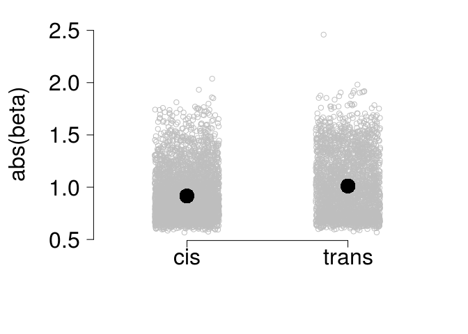
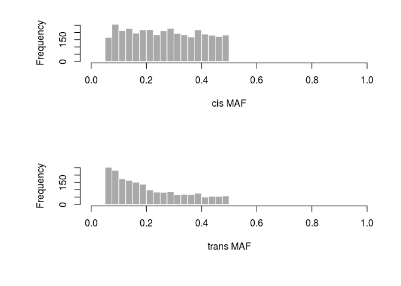
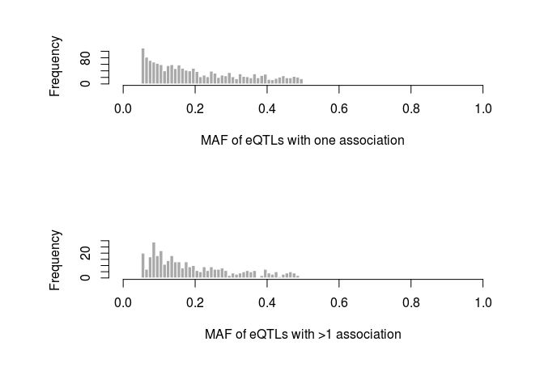

##$ Get the batch-corrected expression data together for mapping 

```r
load('data/wgcna-files/combatOutput.rda')  ##(atch-correction was done in wgcna.md

mycbnames = read.table("data/wgcna-files/mycb-names", stringsAsFactors = F)  ## get the names of the data files

qn <- function(x){qqnorm(x, plot.it=FALSE)$x}
normcb = apply(mycb, 1, qn)#quantile normalize, now columns genes, rows are inds


mycbdf = data.frame(id = mycbnames$x, normcb, stringsAsFactors = F) ##make a data frame of the names and data only

matrixeqtlids = data.frame(V1 = strsplit('10    100    101    102_long    105_clipinplace_sorted    106s_clipped    107    108_3    109    110    111    112    113    114_long    115    117s_clipped    118    11s_clipped    121    123    124_3    125_clipped.bam    126s_clipped    128    129s_clipped    13    131s_clipped    132    133    135    136    137s_clipped    138    139    140    141    142    143s_clipped    144s_clipped    147    148    14_clipped.bam    15    151    152    153    154    155_clipped.bam    156    157    158    160    161_clipped.bam    162    163_clipped    165_clipped.bam    167    16_clipped    17    170_clipped    174_clipped.bam    175_clipped    176    177    178    18    181    182_3    183    184_3    186    187    189    190    192    193    194    195    197    198    1_clipped    20    200    202_long    203_long    204_long    23s_clipped    24    25    26    27    28    29_clipped    30    31    33    34    35    36    38    39s_clipped    41    43s_clipped    44s_clipped    47    49_clipped.bam    4s_clipped    50_long    52    54_clipped    55_clipped    58    5_clipped    61    63    64_replacement    65_clipped    66_clipped    67    70s_clipped    71    72    74    75    76    78s_clipped    79    7s_clipped    8    80s_clipped    81s_clipped    82s_clipped    83    85_long    86    89    9    91    92    93    94    95    96    97_3    98_clipped    99_clipped', split = "    ")[[1]], stringsAsFactors = F) ##add in individual labels


meExp = data.frame(c('id', row.names(mycb)),t(dplyr::left_join(matrixeqtlids, mycbdf, by = c('V1'='id'))), stringsAsFactors = F)
write.table(meExp, file = 'data/matrixeqtl-files/cbExp', row.names=F, quote=F, col.names=F)  ##save the table of expression data
```

### Run matrix eQTL

```r
library("MatrixEQTL")


output_file_name = tempfile();

# Only associations significant at this level will be saved
pvOutputThreshold = 1e-6;


# Error covariance matrix
# Set to numeric() for identity.
errorCovariance = numeric();
# errorCovariance = read.table("Sample_Data/errorCovariance.txt");
useModel = modelLINEAR; # modelANOVA, modelLINEAR, or modelLINEAR_CROSS


# SNPS -- may need to go back and remove snps that don't ahve expression data. maybe not
snps = SlicedData$new();
snps$fileDelimiter = "";      # the TAB character
snps$fileOmitCharacters = "-1"; # denote missing values;
snps$fileSkipRows = 1;          # one row of column labels
snps$fileSkipColumns = 1;       # one column of row labels
snps$fileSliceSize = 2000;      # read file in slices of 2,000 rows
snps$LoadFile('../data/146_tagsnps_transposed')

## expression data
gene = SlicedData$new();
gene$fileDelimiter = "";      # the TAB character
gene$fileOmitCharacters = "NA"; # denote missing values;
gene$fileSkipRows = 1;          # one row of column labels
gene$fileSkipColumns = 1;       # one column of row labels
gene$fileSliceSize = 2000;      # read file in slices of 2,000 rows
#gene$LoadFile('../data/all.med.nomin.formatrixeqtl');
gene$LoadFile('../data/cbExp');

covariates_file_name = '../data/pccovars.foreqtl'
cvrt = SlicedData$new();
cvrt$fileDelimiter = "";      # the TAB character
cvrt$fileOmitCharacters = "NA"; # denote missing values;
cvrt$fileSkipRows = 1;          # one row of column labels
cvrt$fileSkipColumns = 1;       # one column of row labels
if(length(covariates_file_name)>0) {
  cvrt$LoadFile(covariates_file_name);
}


meCovar = Matrix_eQTL_engine(
snps = snps,
gene = gene,
cvrt = cvrt,
output_file_name = output_file_name,
pvOutputThreshold = pvOutputThreshold,
useModel = useModel, 
errorCovariance = errorCovariance, 
verbose = TRUE,
#pvalue.hist=TRUE,
pvalue.hist = 'qqplot',
min.pv.by.genesnp = FALSE,
noFDRsaveMemory = FALSE);

unlink(output_file_name);


save(meCovar, file="matrixeqtl-batched.rda")
```


### Look at eQTL data and plot out locations

```r
load('data/matrixeqtl-files/matrixeqtl-batched.rda')
plot(meCovar) ##qq plot
```

<!-- -->

```r
meCovar$all$ntests
```

```
## [1] 35587985444
```

```r
eqtls = dplyr::filter(meCovar$all$eqtls, FDR < 0.1) ##select significant eQTLs

geneloc = read.table('data/matrixeqtl-files/genelocation.matrixeqtl', header=T, stringsAsFactors = F)
geneloc$gene = as.character(geneloc$geneid)

## merge gene locations with eQTL results (looking at Tag sites only)
locmerge = dplyr::left_join(eqtls, geneloc, by = "gene")
```

```
## Warning: Column `gene` joining factor and character vector, coercing into
## character vector
```

```r
locmerge$snpchr = sapply(locmerge$snps, function(x){strsplit(as.character(x),':')[[1]][1]})
locmerge$snppos = sapply(locmerge$snps, function(x){strsplit(as.character(x),':')[[1]][2]})


#get xlim for the plot
myxlim = lapply(1:8, function(x){
  mychr = dplyr::filter(locmerge, snpchr == paste('scaffold_',as.character(x),sep=""))
  mymax = max(as.numeric(mychr$snppos))
  mymin = min(as.numeric(mychr$snppos))
  return(c(mymin, mymax))
  })


##remove ones with >100 eQTLs
genecounts = dplyr::count(locmerge, gene)
names(genecounts) = c('gene','numbereQTLs')

par(mfrow=c(1,1), mar=c(5,5,2,2))
hist(genecounts$numbereQTLs, col="navy", border="navy", breaks=100, main = "eQTLs per gene", xlab ="")
```

<!-- -->

```r
hist(genecounts$numbereQTLs, col="navy", border="navy", breaks=100, main = "eQTLs per gene", xlab ="", xlim = c(50,1000), ylim =c(0,80))
```

<!-- -->

```r
weirdos = dplyr::filter(genecounts, numbereQTLs>29)
dim(weirdos)
```

```
## [1] 42  2
```

```r
keepsnps = dplyr::filter(genecounts, numbereQTLs < 30)

finalset = dplyr::filter(locmerge, gene %in% keepsnps$gene, !is.na(chr))

nrow(finalset)
```

```
## [1] 6231
```

```r
## plot out the locations of the eQTLs
#postscript("figures/eqtls-pcs.eps",height=9,width=9,paper="special",horizontal=FALSE,colormodel="cymk")
par(mfrow=c(8,8), mar=c(0,0,0,0))
par(mar=c(0,0,0,0))
layout(matrix(c(1,2:9,1,10:17,1,18:25,1,26:33,1,34:41,1,42:49,1,50:57,1,58:65, rep(66,9)), 9, 9, byrow = TRUE))
plot.new()
text(0.25,0.5,"Gene location", srt=90, cex=2.5)
for (i in 8:1){ ##gene locations
  for (j in 1:8){  ##snp location
  mygenechr = paste('scaffold_',as.character(i),sep="")
  mysnpchr = paste('scaffold_',as.character(j),sep="")
mychrom = dplyr::filter(finalset, chr ==mygenechr & snpchr == mysnpchr)
mysigfdr = dplyr::filter(mychrom, FDR<0.1)
plot(mychrom$snppos,mychrom$s1, col = 'darkgray', xlab = "", ylab = "", yaxt="n", xaxt="n", lwd=2,cex=1, xlim = myxlim[[j]])
#text(100000,100000,paste('gene location is',as.character(i)))
if (j==1){mtext(i, side = 2, cex=1.5, las=2, line=1)} ##if at chrom 1 for snps
if(i==1){mtext(j, side=1, cex=1.5, line=1)} ## if at chrom 1 for genes

  }
}
plot.new()
text(0.5,0.25, "SNP location", cex=2.5)
```

<!-- -->


### Compare cis and trans effect sizes

```r
### get the distances of eqtls from the gene
par(mar=c(7,7,2,2), mfrow=c(1,1))


finalset$qtldist = apply(finalset, 1, function(x){
  qtldist = 1e8
  if (x[8] == x[11]){ ##on the same chromosome
  qtldist1 = abs(as.numeric(x[9])-as.numeric(x[12])) ##gene start - snpchr 
  qtldist2 = abs(as.numeric(x[10])-as.numeric(x[12])) ## gene end - snp chr
  qtldist = min(qtldist1, qtldist2)
  }
  return(qtldist)
})

hist(finalset$qtldist, xlim = c(0,1e4), col="navy", main = "distances on same chrom", breaks=100000, ylim = c(0,6000), xlab ="")
```

<!-- -->

```r
ciseqtls = dplyr::filter(finalset, qtldist < 5000, FDR < 0.1)
transeqtls = dplyr::filter(finalset, qtldist > 5000, FDR < 0.1)
nrow(ciseqtls)
```

```
## [1] 3759
```

```r
nrow(transeqtls)
```

```
## [1] 2472
```

```r
## plot of how many cis and trans eqtls there are at FDR = 0.1
mybp= barplot(c(nrow(ciseqtls), nrow(transeqtls)), xaxt='n', col = "darkgray", border="white", ylim = c(0,5000), xlim = c(-0.5,3), yaxt="n")
axis(1, at = mybp, labels = c('cis','trans'), cex.axis=2, tick = F, col = "white")
axis(2, las=2, cex.axis=2)
```

<!-- -->

```r
### Compare effect sizes of cis and trans eqtls.
mytest = t.test(abs(ciseqtls$beta), abs(transeqtls$beta)) ## cis eqtls have smaller effects but not by that much
mytest
```

```
## 
## 	Welch Two Sample t-test
## 
## data:  abs(ciseqtls$beta) and abs(transeqtls$beta)
## t = -13.293, df = 4498.4, p-value < 2.2e-16
## alternative hypothesis: true difference in means is not equal to 0
## 95 percent confidence interval:
##  -0.10768260 -0.08000152
## sample estimates:
## mean of x mean of y 
## 0.9168799 1.0107220
```

```r
mytest$p.value
```

```
## [1] 1.413332e-39
```

```r
plot(jitter(c(rep(1, nrow(ciseqtls)), rep(2, nrow(transeqtls)))), abs(c(ciseqtls$beta, transeqtls$beta)), bty="n", xlim = c(0.5,2.5), xaxt="n", yaxt = "n", col = "gray", xlab = "", ylab = "")
axis(2, las=2, cex.axis=2)
mtext('abs(beta)',2, line=5, cex=2)
axis(1,at = c(1,2), lab = c('cis','trans'), cex.axis=2)
points(c(1,2), c(mean(abs(ciseqtls$beta)), mean(abs(transeqtls$beta))), cex=3, pch=16)
```

<!-- -->

```r
par(mfrow=c(2,1))
hist(abs(ciseqtls$beta), xlim = c(0,3), col = "darkgray", border="white", breaks=seq(0,3,.1), main="", xlab = "local effect", freq=F)
hist(abs(transeqtls$beta), xlim = c(0,3), col = "darkgray", border="white", breaks = seq(0,3,.1), main="", xlab ="trans effect", freq=F)
```

<!-- -->


### Compare minor allele frequencies of cis and trans eQTLs

```r
finalset$rs = as.character(finalset$snps)
mygemma = read.table('data/gemma-files/tb.16.assoc.txt', header=T, stringsAsFactors=F) ##read in mafs from a gemma file
finalaf = dplyr::left_join(finalset, mygemma[,c(2,5,6,7)], by = 'rs')

ciseqtls = dplyr::filter(finalaf, qtldist < 5000, FDR < 0.1)
transeqtls = dplyr::filter(finalaf, qtldist > 5000, FDR < 0.1)


t.test(ciseqtls$af, transeqtls$af) 
```

```
## 
## 	Welch Two Sample t-test
## 
## data:  ciseqtls$af and transeqtls$af
## t = 15.73, df = 5177.1, p-value < 2.2e-16
## alternative hypothesis: true difference in means is not equal to 0
## 95 percent confidence interval:
##  0.04586505 0.05892493
## sample estimates:
## mean of x mean of y 
## 0.2666848 0.2142899
```

```r
t.test(ciseqtls$af, transeqtls$af)$p.value
```

```
## [1] 1.691664e-54
```

```r
##driven by the hotspot? remove duplicates from the trans
transunique = transeqtls[!duplicated(transeqtls$rs),]
dim(transunique)
```

```
## [1] 2011   17
```

```r
cisunique = ciseqtls[!duplicated(ciseqtls$rs),]
dim(cisunique)
```

```
## [1] 3618   17
```

```r
t.test(cisunique$af, transunique$af) ## c
```

```
## 
## 	Welch Two Sample t-test
## 
## data:  cisunique$af and transunique$af
## t = 15.915, df = 4063, p-value < 2.2e-16
## alternative hypothesis: true difference in means is not equal to 0
## 95 percent confidence interval:
##  0.04999115 0.06403808
## sample estimates:
## mean of x mean of y 
## 0.2680197 0.2110051
```

```r
par(mar=c(7,7,2,2), mfrow=c(1,1))
plot(jitter(c(rep(1, nrow(cisunique)), rep(2, nrow(transunique)))), c(cisunique$af, transunique$af), bty="n", xlim = c(0.5,2.5), xaxt="n", yaxt = "n", col = "gray", xlab = "", ylab = "")
axis(2, las=2, cex.axis=2)
mtext('MAF',2, line=5, cex=2)
axis(1,at = c(1,2), lab = c('cis','trans'), cex.axis=2)
points(c(1,2), c(mean(cisunique$af, na.rm=T), mean(transunique$af, na.rm=T)), cex=3, pch=16)
```

<!-- -->

```r
par(mfrow=c(2,1))
hist(cisunique$af, xlim = c(0,1), col = "darkgray", border="white", breaks=seq(0,1,.025), main="", xlab = "cis MAF", freq=T)
hist(transunique$af, xlim = c(0,1), col = "darkgray", border="white", breaks = seq(0,1,0.025), main="", xlab ="trans MAF", freq=T)
```

<!-- -->

```r
### how robust is it to our cis/trans cutoff?

### with distance of 1000
ciseqtls1000 = dplyr::filter(finalaf, qtldist < 1000, FDR < 0.1)
transeqtls1000 = dplyr::filter(finalaf, qtldist > 1000, FDR < 0.1)
transunique1000 = transeqtls1000[!duplicated(transeqtls1000$rs),]
cisunique1000 = ciseqtls1000[!duplicated(ciseqtls1000$rs),]
t.test(cisunique1000$af, transunique1000$af) ## c
```

```
## 
## 	Welch Two Sample t-test
## 
## data:  cisunique1000$af and transunique1000$af
## t = 14.626, df = 5278.1, p-value < 2.2e-16
## alternative hypothesis: true difference in means is not equal to 0
## 95 percent confidence interval:
##  0.04388721 0.05747355
## sample estimates:
## mean of x mean of y 
## 0.2769975 0.2263172
```

```r
## distance of 2500
ciseqtls2500 = dplyr::filter(finalaf, qtldist < 2500, FDR < 0.1)
transeqtls2500 = dplyr::filter(finalaf, qtldist > 2500, FDR < 0.1)
transunique2500 = transeqtls2500[!duplicated(transeqtls2500$rs),]
cisunique2500 = ciseqtls2500[!duplicated(ciseqtls2500$rs),]
t.test(cisunique2500$af, transunique2500$af) ## c
```

```
## 
## 	Welch Two Sample t-test
## 
## data:  cisunique2500$af and transunique2500$af
## t = 15.722, df = 5065.5, p-value < 2.2e-16
## alternative hypothesis: true difference in means is not equal to 0
## 95 percent confidence interval:
##  0.04775797 0.06136463
## sample estimates:
## mean of x mean of y 
## 0.2708454 0.2162841
```

```r
## distance of 10000
ciseqtls10000 = dplyr::filter(finalaf, qtldist < 10000, FDR < 0.1)
transeqtls10000 = dplyr::filter(finalaf, qtldist > 10000, FDR < 0.1)
transunique10000 = transeqtls10000[!duplicated(transeqtls10000$rs),]
cisunique10000 = ciseqtls10000[!duplicated(ciseqtls10000$rs),]
t.test(cisunique10000$af, transunique10000$af) ## c
```

```
## 
## 	Welch Two Sample t-test
## 
## data:  cisunique10000$af and transunique10000$af
## t = 16.537, df = 3247.7, p-value < 2.2e-16
## alternative hypothesis: true difference in means is not equal to 0
## 95 percent confidence interval:
##  0.05411686 0.06867560
## sample estimates:
## mean of x mean of y 
## 0.2669558 0.2055596
```

```r
save('finalaf', file = "data/allbyall.rda")
```

### Are allele frequencies different within large effect eQTL only?

```r
summary(abs(finalaf$beta))
```

```
##    Min. 1st Qu.  Median    Mean 3rd Qu.    Max. 
##  0.5663  0.7424  0.8809  0.9541  1.1046  2.4590
```

```r
ciseqtlslarge = dplyr::filter(finalaf, qtldist < 5000, FDR < 0.1, abs(beta) > summary(abs(finalaf$beta))[5]) ## only looking at top quartile of effect size
nrow(ciseqtlslarge)
```

```
## [1] 721
```

```r
transeqtlslarge = dplyr::filter(finalaf, qtldist > 5000, FDR < 0.1, abs(beta) > summary(abs(finalaf$beta))[5])
nrow(transeqtlslarge)
```

```
## [1] 837
```

```r
##remove duplicates
transuniquelarge = transeqtlslarge[!duplicated(transeqtlslarge$rs),]
dim(transuniquelarge)
```

```
## [1] 692  17
```

```r
cisuniquelarge = ciseqtlslarge[!duplicated(ciseqtlslarge$rs),]
dim(cisuniquelarge)
```

```
## [1] 684  17
```

```r
t.test(ciseqtlslarge$af,transeqtlslarge$af)
```

```
## 
## 	Welch Two Sample t-test
## 
## data:  ciseqtlslarge$af and transeqtlslarge$af
## t = 5.5458, df = 1335.3, p-value = 3.524e-08
## alternative hypothesis: true difference in means is not equal to 0
## 95 percent confidence interval:
##  0.01060059 0.02220522
## sample estimates:
##  mean of x  mean of y 
## 0.11409484 0.09769193
```

```r
t.test(cisuniquelarge$af,transuniquelarge$af)
```

```
## 
## 	Welch Two Sample t-test
## 
## data:  cisuniquelarge$af and transuniquelarge$af
## t = 5.4179, df = 1286.4, p-value = 7.19e-08
## alternative hypothesis: true difference in means is not equal to 0
## 95 percent confidence interval:
##  0.01094275 0.02336568
## sample estimates:
##  mean of x  mean of y 
## 0.11475037 0.09759615
```


### Remake the plot of all eQTLs but add in the coexpression eqtls


```r
table1 = read.table('Table1', header=T, stringsAsFactors=F)
table1$scaf = c(7,8,4,4)
table1$pos = sapply(table1$loc, function(x){strsplit(x, split=":")[[1]][2]})

#postscript("figures/eqtls-pcs.eps",height=9,width=9,paper="special",horizontal=FALSE,colormodel="cymk")
par(mfrow=c(8,8), mar=c(0,0,0,0))
layout(matrix(c(1,2:9,1,10:17,1,18:25,1,26:33,1,34:41,1,42:49,1,50:57,1,58:65, rep(66,9)), 9, 9, byrow = TRUE))
plot.new()
text(0.25,0.5,"Gene location", srt=90, cex=2.5)
for (i in 8:1){ ##gene locations
  for (j in 1:8){  ##snp location
  mygenechr = paste('scaffold_',as.character(i),sep="")
  mysnpchr = paste('scaffold_',as.character(j),sep="")
mychrom = dplyr::filter(finalset, chr ==mygenechr & snpchr == mysnpchr)
plot(mychrom$snppos,mychrom$s1, col = 'darkgray', xlab = "", ylab = "", yaxt="n", xaxt="n", lwd=2,cex=1, xlim = myxlim[[j]])
mycoexp = dplyr::filter(table1, scaf == j)
if (nrow(mycoexp)>0){
  mycoexpoverlaps = dplyr::filter(mychrom, snppos %in% mycoexp$pos)
  points(mycoexpoverlaps$snppos, mycoexpoverlaps$s1, col = "black", pch=16)
}


#text(100000,100000,paste('gene location is',as.character(i)))
if (j==1){mtext(i, side = 2, cex=1.5, las=2, line=1)} ##if at chrom 1 for snps
if(i==1){mtext(j, side=1, cex=1.5, line=1)} ## if at chrom 1 for genes


  }
}
plot.new()
text(0.5,0.25, "SNP location", cex=2.5)
```

<!-- -->


### Testing for a relationship between number of genes and effect size

```r
par(mfrow=c(1,1), mar=c(7,7,3,3))

##get unique number of genes
genecounts = dplyr::count(finalaf, gene)
nrow(genecounts)
```

```
## [1] 2341
```

```r
## get number of genes per snp
snpcounts = dplyr::count(finalaf, snps)
summary(snpcounts$n)
```

```
##    Min. 1st Qu.  Median    Mean 3rd Qu.    Max. 
##    1.00    1.00    1.00    1.14    1.00   93.00
```

```r
nrow(snpcounts) #total number of snps with at least one association
```

```
## [1] 5468
```

```r
nrow(dplyr::filter(snpcounts, n>1)) #snps with >1 association
```

```
## [1] 489
```

```r
par(mfrow=c(2,1))
hist(snpcounts$n, col = "darkgray", border="white", xlab = "# of genes associated with each snp", main="", breaks=seq(0,100))
hist(snpcounts$n, col = "darkgray", border="white", xlab = "# of genes associated with each snp", main="", breaks=seq(0,100), ylim = c(0,100), xlim = c(0,20))
```

<!-- -->

```r
##compare snps with 1 assoc to snps with >1 assoc
snpcountsaf = dplyr::left_join(snpcounts, finalaf, by="snps")## get the af in the snp counts table
snpcountsaf = dplyr::filter(snpcountsaf, qtldist > 5000) ##transonly to make sure not a weird cis-trans issue
snpcountsaf = snpcountsaf[!duplicated(snpcountsaf$snps),]#remove duplicates
onegene = dplyr::filter(snpcountsaf, n == 1) #
nrow(onegene)
```

```
## [1] 1635
```

```r
moregenes = dplyr::filter(snpcountsaf, n>1)
nrow(moregenes)
```

```
## [1] 376
```

```r
t.test(onegene$af, moregenes$af)
```

```
## 
## 	Welch Two Sample t-test
## 
## data:  onegene$af and moregenes$af
## t = 2.6187, df = 571.45, p-value = 0.009061
## alternative hypothesis: true difference in means is not equal to 0
## 95 percent confidence interval:
##  0.00457208 0.03200982
## sample estimates:
## mean of x mean of y 
## 0.2143493 0.1960583
```

```r
par(mfrow=c(2,1))
hist(onegene$af, col = "darkgray", border="white", xlab = "MAF of eQTLs with one association", main="", breaks=seq(0,1, 0.01))
hist(moregenes$af, col = "darkgray", border="white", xlab = "MAF of eQTLs with >1 association", main="", breaks=seq(0,1, 0.01))
```

<!-- -->

```r
plot(jitter(c(rep(1, nrow(onegene)), rep(2, nrow(moregenes)))), c(onegene$af, moregenes$af), bty="n", xlim = c(0.5,2.5), xaxt="n", yaxt = "n", col = "gray", xlab = "", ylab = "")
axis(2, las=2, cex.axis=2)
mtext('MAF',2, line=5, cex=2)
axis(1,at = c(1,2), lab = c('cis','trans'), cex.axis=2)
points(c(1,2), c(mean(onegene$af, na.rm=T), mean(moregenes$af, na.rm=T)), cex=3, pch=16)
```

<!-- -->


### How many of the matrix eQTLs overlap with eQTLs from 2015 paper?


```r
oldeqtls = read.table('data/eqtl.kw.nonas.all', header=T, stringsAsFactors = F)
oldeqtls$rs = sapply(1:nrow (oldeqtls), function(x){
  paste('scaffold_',substr(oldeqtls$scaf[x], 5, 100),':',oldeqtls$locus[x], sep="")
  })

oldmer = dplyr::left_join(ciseqtls, oldeqtls, by="rs") %>% dplyr::filter(pac == gene)


plot(-log10(oldmer$p), -log10(oldmer$pvalue), bty="n", xlab = "Josephs 2015 -log10(p)", ylab = "matrix eqtl -log10(p)")
```

<!-- -->

```r
##how many of the matrix eqtls are also Josephs 2015 eqtls?
nrow(oldmer) ##number of matrix cis eqtls with matches
```

```
## [1] 3380
```

```r
nrow(dplyr::filter(oldmer, p < 0.05))
```

```
## [1] 3300
```

```r
nrow(dplyr::filter(oldmer, p <  8.2e-4)) ##cutoff from paper
```

```
## [1] 2636
```

```r
aseqtls = read.table('data/eqtl.ase.out.all', header=T, stringsAsFactors = F)
aseqtls$rs = sapply(1:nrow (aseqtls), function(x){
  paste('scaffold_',substr(aseqtls$scaf[x], 5, 100),':',aseqtls$locus[x], sep="")
  })

asemer = dplyr::left_join(ciseqtls, aseqtls, by="rs") %>% dplyr::filter(pac == gene)
```
