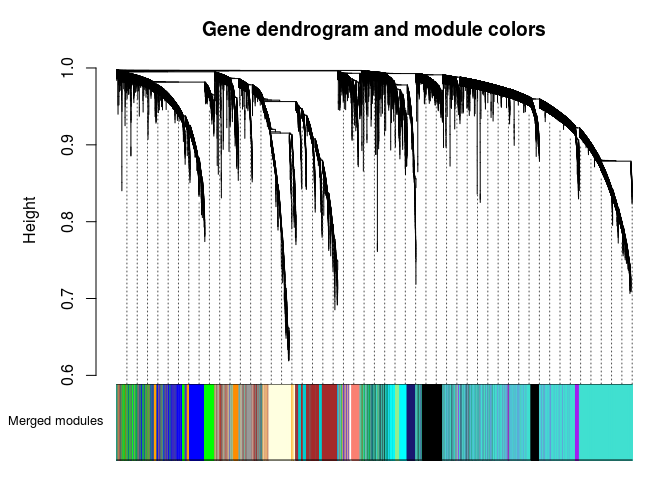
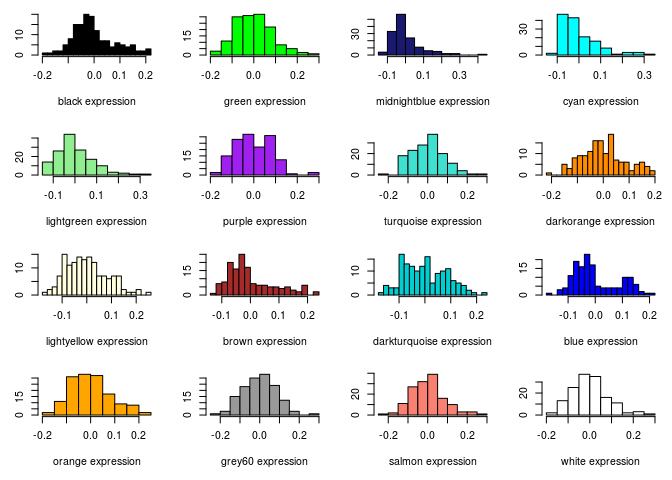
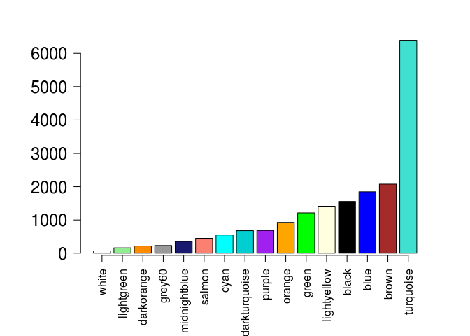
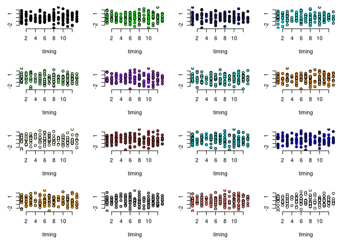
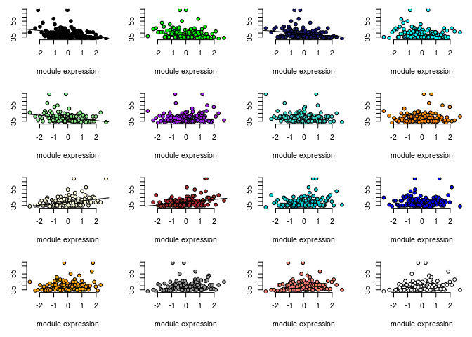

### Adjusted expression data for batch effect (collection timing)

```r
myexp = read.table('data/all.med.min5', header=T)
myexp0 = as.data.frame(t(myexp[,-1]))
names(myexp0) = myexp$pac
myexp0$RNA = sapply(row.names(myexp0), function(x){substr(x,2,1000)}) ##add in a column with the RNA name
myexp0$RNA[49] <- '157all' #slightly mismatched names
myexp0$RNA[53] <- '161A'


## batch effects
coltiming = read.table('data/coltiming', stringsAsFactors = F, header=T)
mymer = dplyr::inner_join(coltiming, myexp0, by="RNA")

## just the 146 individuals
my146 = read.table('data/146_DNA_names_forplink', header=F, stringsAsFactors = F)
mymer2 = dplyr::inner_join(my146, mymer, by = c('V2'='DNA_vcfname'))

write.table(mymer2$V2, file="data/wgcna-files/mycb-names")

# adjust for batch effects
#mycb = ComBat(dat = t(mymer2[,-c(1:5)]), batch = mymer2$timeindex)

#save(mycb, file = "data/wgcna-files/combatOutput.rda")
```

### Ran WGCNA on HPCC. Code is below:


```r
library('WGCNA')
library('flashClust')
load('../data/wgcna-files/combatOutput.rda')

adjsigned=adjacency(t(mycb),selectCols = NULL, type="signed", power=12) #makes adjency matrix for correlations all the genes with all other genes
TOMsigned = TOMsimilarity(adjsigned); ##makes topological overlap matrix
dissTOMsigned = 1-TOMsigned;
minModuleSize = 30;
geneTree = flashClust(as.dist(dissTOMsigned), method = "average"); ##make hclust object#save(geneTree, file='genetree.rda')

dynamicMods = cutreeDynamic(dendro = geneTree, distM = dissTOMsigned,
deepSplit = 2, pamRespectsDendro = FALSE,
minClusterSize = minModuleSize);
sampleTree = hclust(dist(mycb), method = "average");
dynamicColors = labels2colors(dynamicMods)
MEList = moduleEigengenes(t(mycb), colors = dynamicColors)
MEs = MEList$eigengenes
MEDissThres = 0.20
# Call an automatic merging function
merge = mergeCloseModules(t(mycb), dynamicColors, cutHeight = MEDissThres, verbose = 3);
# The merged module colors
mergedColors = merge$colors
# Eigengenes of the new merged modules:
mergedMEs = merge$newMEs


# Rename to moduleColors
moduleColors = mergedColors;
# Construct numerical labels corresponding to the colors
colorOrder = c("grey", standardColors(50));
moduleLabels = match(moduleColors, colorOrder)-1;
MEs = mergedMEs;
# Save module colors and labels for use in subsequent part
save(MEs, moduleLabels, moduleColors, geneTree, file = "../data/wgcna-files/PlantSigned-networkConstructionEM-stepByStep.RData")


# Recalculate MEs with color labels
MEs0 = moduleEigengenes(t(mycb), moduleColors)$eigengenes;
MEs = orderMEs(MEs0);
moduleColorsEM=mergedColors;
MEList = moduleEigengenes(t(mycb), colors = mergedColors)
MEs = MEList$eigengenes

#Now find and write to file the module membership values (KME's) for each gene
datKME=signedKME(t(mycb), MEs)
write.csv(datKME, file = "../data/wgcna-files/KME_EM.csv")

#Now write to file the module labels (colors) for each gene
write.csv(mergedColors, file = "../data/wgcna-files/mergedColors_EM.csv")

#Now write to file the "fundamentals" for each gene
fund_EM<-fundamentalNetworkConcepts(adjsigned, GS = NULL);
write.csv(fund_EM, file = "../data/wgcna-files/fund_EM.csv")

#Now write to file the intra-modular connectivity not scaled for each gene
conNotScaled_EM=intramodularConnectivity(adjsigned, mergedColors, scaleByMax = FALSE)
write.csv(conNotScaled_EM, file = "../data/wgcna-files/conNotScaled_EM.csv")

#Now write to file the intra-modular connectivity SCALED for each gene
conScaled_EM=intramodularConnectivity(adjsigned, mergedColors, scaleByMax = TRUE)
write.csv(conScaled_EM, file = "../data/wgcna-files/conScaled_EM.csv")
```


###Looking at the modules

```r
#how many modules are there?
load('data/wgcna-files/PlantSigned-networkConstructionEM-stepByStep.RData')

ncol(MEs) ##there are 16 modules
```

```
## [1] 16
```

```r
##histograms of the distributions
cols = as.vector(sapply(names(MEs), function(x) substr(x, 3, 100)))
#postscript("suppfig_module_dists.eps",height=11,width=8,paper="special",horizontal=FALSE,colormodel="cymk")

par(mfrow=c(4,4), mar = c(5,3,1,1))
for (i in seq(16)) {
   hist(MEs[,i], main="", ylab = "", xlab = paste(cols[i]," expression", sep=""), col = cols[i], border= "black", breaks=15, yaxt="n", xaxt = "n")
  axis(1)
  axis(2)
  }
```

<!-- -->

```r
#dev.off()


##number of genes per module
moduledf = data.frame(pac = myexp$pac, module = moduleColors, stringsAsFactors = F)
par(mfrow=c(1,1), mar=c(6,6,3,3))
moduleCounts = sort(table(moduledf$module))
test = barplot(moduleCounts, col = names(moduleCounts), names.arg=NULL, xaxt="n", yaxt = "n")
axis(2, las=2, cex.axis=1.5)
axis(1, at = test, las=2, labels = names(moduleCounts))
```

<!-- -->

```r
##quantile normalize the eigenvalues
qn <- function(x){qqnorm(x, plot.it=FALSE)$x}
nEigens = data.frame(apply(MEs, 2,qn))
nEigens$id = mymer2$V2


##Correlated with collection timing?
tmer = dplyr::inner_join(nEigens, coltiming, by = c('id' = 'DNA_vcfname'))
par(mfrow=c(4,4), mar = c(5,3,1,1))
for (i in seq(16)) {
   plot(tmer$timeindex,tmer[,i], main="", ylab = "", xlab = "timing", bg = cols[i], pch = 21,yaxt="n", xaxt = "n", bty="n")
  axis(1)
  axis(2)
  }
```

<!-- -->

```r
##Correlated with phenotypes?
phenos = read.table('data/phenotypes_NA.txt', header=T, stringsAsFactors = F)
pmer = dplyr::left_join(tmer, phenos, by = c('id'='IID'))

##bolting
par(mfrow=c(4,4), mar = c(5,3,1,1))
for (i in seq(16)) {
   plot(pmer[,i], pmer$bolt, main="", ylab = "bolt", xlab = "module expression", bg = cols[i], pch = 21,yaxt="n", xaxt = "n", bty="n")
  myl = lm(pmer$bolt ~ pmer[,i])
  if(summary(myl)$coefficients[2,4]<0.05/16){abline(myl)}
    axis(1)
  axis(2)
  }
```

<!-- -->

```r
par(mfrow=c(4,4), mar = c(5,3,1,1))
for (i in seq(16)) {
   plot(pmer[,i], pmer$N, main="", ylab = "N", xlab = "module expression", bg = cols[i], pch = 21,yaxt="n", xaxt = "n", bty="n")
  myl = lm(pmer$N ~ pmer[,i])
  if(summary(myl)$coefficients[2,4]<0.05/16){abline(myl)}
    axis(1)
  axis(2)
}
```

<!-- -->


```r
##make the fam file for gemma
myfam = read.table('data/gemma-files/t146.fam', stringsAsFactors = F)

#get normalized eigenvalues in the right order
mymerge = dplyr::left_join(myfam, nEigens, by = c('V2'='id'))
##leaving the NA in for now... it should get filetered out

newfam = mymerge[,c(1:5, 7:22)]
write.table(newfam, file = 'data/gemma-files/t146-batched.fam', row.names=F, col.names=F, quote=F)
```


